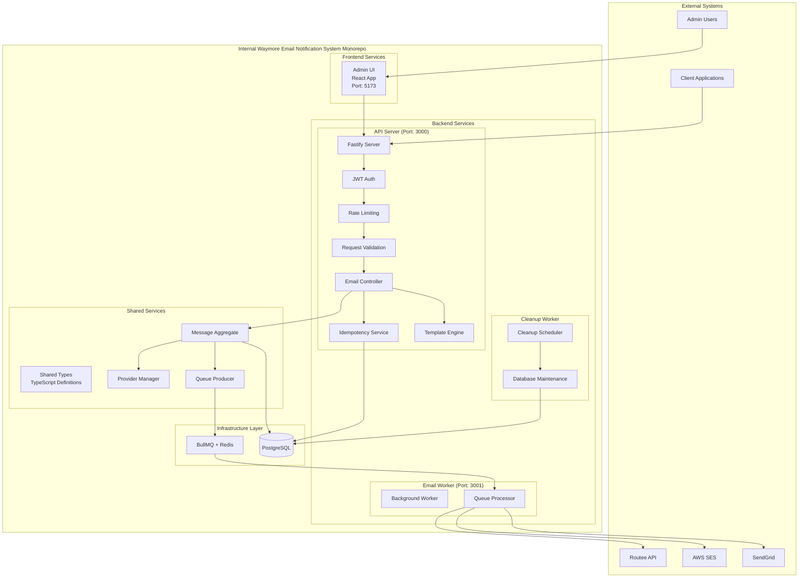
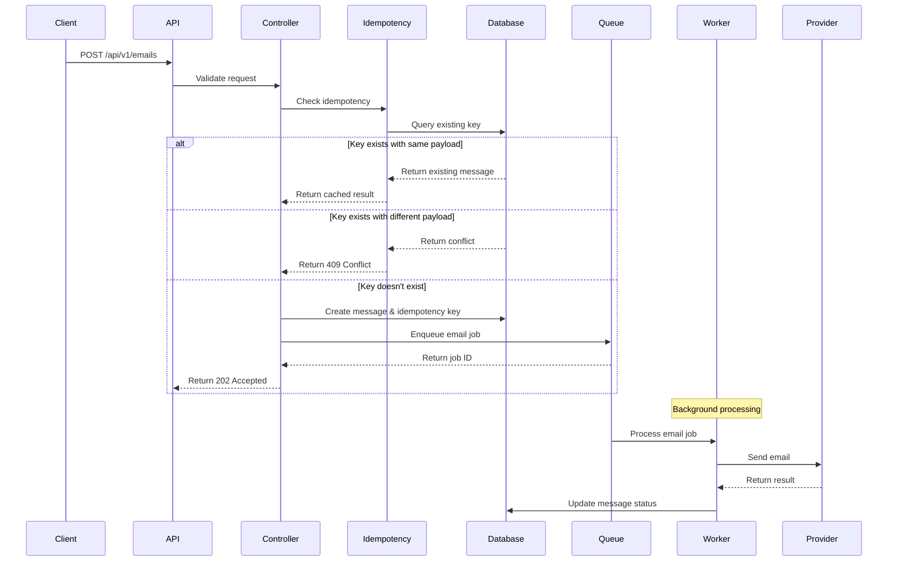
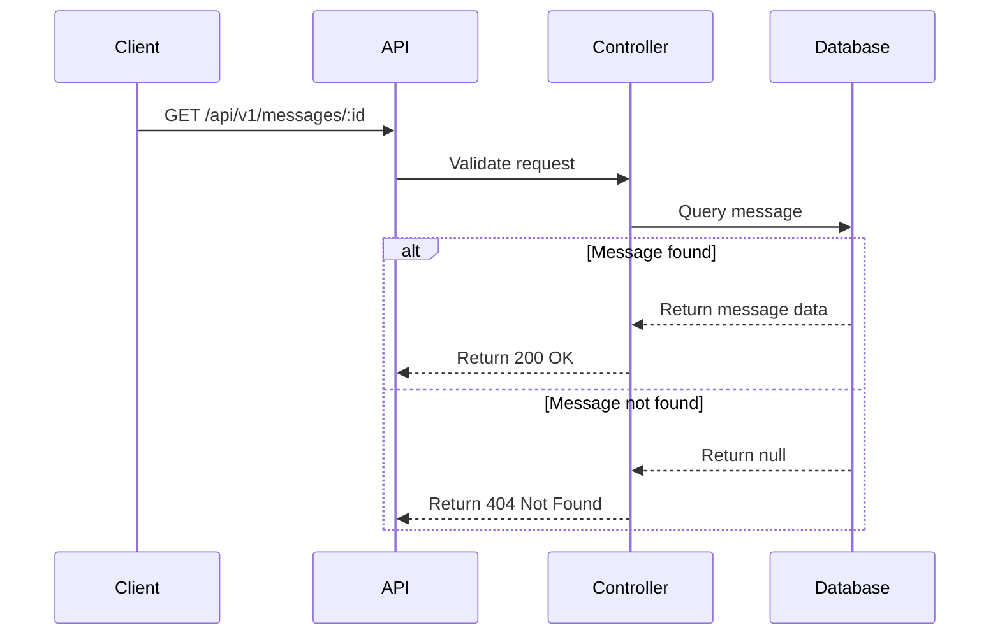
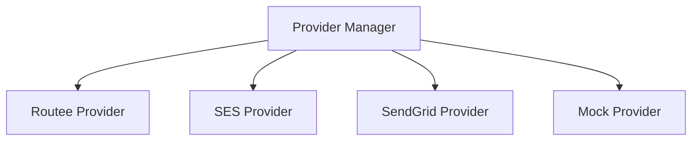

# Waymore Transactional Emails Service Architecture

## System Overview

The Waymore Transactional Emails Service is a **monorepo** containing multiple microservices designed to provide a standardized, reliable interface for sending emails across the Waymore platform. It follows clean architecture principles with clear separation of concerns, high testability, and proper service isolation within a unified codebase.

## Monorepo Architecture

The service is organized as a monorepo with the following structure:

```
emailgateway/
├── packages/
│   ├── api-server/           # Main HTTP API service
│   ├── email-worker/         # Background email processing
│   ├── cleanup-worker/       # Database maintenance service
│   ├── admin-ui/             # React admin interface
│   └── shared-types/         # Shared TypeScript types
├── scripts/                  # Build and deployment scripts
├── docs/                     # Documentation
└── infrastructure/           # Docker and deployment configs
```

### Service Responsibilities

| Service | Port | Purpose | Dependencies |
|---------|------|---------|--------------|
| **API Server** | 3000 | HTTP API, admin dashboard, template management | PostgreSQL, Redis, Shared Types |
| **Email Worker** | 3001 | Background processing, email sending | Redis, Shared Types |
| **Admin UI** | 5173 | React frontend, template editor, monitoring | API Server, Shared Types |
| **Cleanup Worker** | - | Database maintenance, scheduled cleanup | PostgreSQL, Shared Types |
| **Shared Types** | - | TypeScript definitions | None |

## Architecture Principles

### 1. Clean Architecture
- **Independence**: Business logic is independent of frameworks, UI, and external agencies
- **Testability**: Business rules can be tested without UI, database, web server, or external elements
- **UI Independence**: UI can change without changing the rest of the system
- **Database Independence**: Business rules are not bound to the database
- **Framework Independence**: Business logic is independent of any external framework

### 2. Domain-Driven Design
- **Bounded Context**: Email sending is treated as a distinct domain
- **Ubiquitous Language**: Common terminology across all layers
- **Aggregate Roots**: Message and IdempotencyKey as primary entities

### 3. Event-Driven Architecture
- **Asynchronous Processing**: Email sending happens asynchronously
- **Event Sourcing**: All state changes are captured as events
- **CQRS**: Command Query Responsibility Segregation for read/write operations

## High-Level Architecture



## Layer Architecture

### 1. API Layer (Presentation)
**Responsibility**: HTTP interface, request/response handling, authentication

**Components**:
- **Fastify Server**: High-performance HTTP server
- **Route Handlers**: Endpoint definitions and request routing
- **Middleware**: Authentication, rate limiting, CORS, logging
- **Serializers**: Request/response transformation

**Key Files**:
```
packages/api-server/src/api/
├── routes/
│   ├── email.ts      # Email API routes
│   ├── health.ts     # Health check routes
│   ├── admin.ts      # Admin dashboard routes
│   └── templates.ts  # Template management routes
├── controllers/
│   ├── email.ts      # Email business logic
│   ├── health.ts     # Health check logic
│   └── admin.ts      # Admin dashboard logic
└── schemas/
    └── email.ts      # Request/response schemas
```

### 2. Application Layer
**Responsibility**: Application services, use cases, orchestration

**Components**:
- **Email Controller**: Orchestrates email sending flow
- **Idempotency Service**: Handles duplicate request prevention
- **Template Engine**: Renders email templates
- **Validation Service**: Input validation and sanitization

**Key Files**:
```
packages/api-server/src/utils/
├── auth.ts          # JWT authentication
├── idempotency.ts   # Idempotency handling
├── logger.ts        # Structured logging
└── metrics.ts       # Performance metrics
```

### 3. Domain Layer
**Responsibility**: Business logic, domain entities, business rules

**Components**:
- **Message Aggregate**: Core email message entity
- **Provider Manager**: Email provider abstraction
- **Queue Producer**: Job queuing interface
- **Template Engine**: Template rendering logic

**Key Files**:
```
packages/api-server/src/providers/
├── types.ts         # Provider interfaces
├── manager.ts       # Provider management
└── routee.ts        # Routee implementation
```

### 4. Infrastructure Layer
**Responsibility**: External services, data persistence, queue processing

**Components**:
- **Database**: PostgreSQL with Prisma ORM
- **Queue System**: BullMQ with Redis
- **Background Worker**: Async job processing
- **External APIs**: Email provider integrations

**Key Files**:
```
packages/api-server/src/queue/
└── producer.ts      # Job producer

packages/email-worker/src/
├── worker.ts        # Background worker
└── producer.ts      # Worker-specific producer

packages/cleanup-worker/src/
├── worker-cleanup.ts # Cleanup worker
├── cleanup.ts       # Cleanup logic
└── scheduler.ts     # Cleanup scheduler

packages/api-server/src/db/
└── client.ts        # Database client
```

## Monorepo Structure

### Package Organization

Each package in the monorepo has a specific responsibility and can be developed, built, and deployed independently:

#### API Server (`packages/api-server/`)
- **Purpose**: Main HTTP API service
- **Port**: 3000
- **Dependencies**: PostgreSQL, Redis, Shared Types
- **Key Features**:
  - REST API endpoints
  - Admin dashboard backend
  - Template management
  - Authentication and authorization
  - Rate limiting and validation

#### Email Worker (`packages/email-worker/`)
- **Purpose**: Background email processing
- **Port**: 3001
- **Dependencies**: Redis, Shared Types, API Server (for templates)
- **Key Features**:
  - Queue processing
  - Email rendering
  - Provider integration
  - Retry logic and error handling

#### Admin UI (`packages/admin-ui/`)
- **Purpose**: React frontend interface
- **Port**: 5173
- **Dependencies**: API Server, Shared Types
- **Key Features**:
  - Template editor
  - Message monitoring
  - Dashboard and analytics
  - Test email functionality

#### Cleanup Worker (`packages/cleanup-worker/`)
- **Purpose**: Database maintenance
- **Dependencies**: PostgreSQL, Shared Types
- **Key Features**:
  - Scheduled cleanup tasks
  - Data retention policies
  - Performance optimization

#### Shared Types (`packages/shared-types/`)
- **Purpose**: TypeScript type definitions
- **Dependencies**: None
- **Key Features**:
  - Common interfaces
  - API contracts
  - Frontend/backend type consistency

### Shared Types Architecture

The shared types package ensures type safety and consistency across all services:

```typescript
// packages/shared-types/index.ts
export * from './template.types';
export * from './admin.types';
export * from './api.types';
export * from './email.types';
export * from './frontend.types';
```

**Type Categories**:
- **Template Types**: Template metadata, locales, variables
- **Email Types**: Message status, recipients, providers
- **API Types**: Request/response schemas, pagination
- **Admin Types**: Dashboard data, health checks
- **Frontend Types**: Serialized versions for JSON transport

### Development Workflow

1. **Local Development**: `npm run dev:all` starts all services
2. **Individual Services**: Each package can be run independently
3. **Type Safety**: Shared types ensure consistency across services
4. **Hot Reloading**: All services support hot reloading during development

## Data Flow

### 1. Email Sending Flow



### 2. Message Status Query Flow



## Domain Model

### Core Entities

#### Message Aggregate
```typescript
interface Message {
  messageId: string;           // Unique identifier
  tenantId?: string;          // Tenant isolation
  toJson: Recipient[];        // Recipients
  subject: string;            // Email subject
  templateKey: string;        // Template identifier
  locale: string;             // Language/locale
  variablesJson: object;      // Template variables
  provider?: string;          // Selected provider
  status: MessageStatus;      // Current status
  attempts: number;           // Retry attempts
  lastError?: string;         // Last error message
  webhookUrl?: string;        // Internal webhook endpoint (set via WEBHOOK_BASE_URL)
  createdAt: Date;           // Creation timestamp
  updatedAt: Date;           // Last update timestamp
}

enum MessageStatus {
  QUEUED = 'QUEUED',
  SENT = 'SENT',
  DELIVERED = 'DELIVERED',
  BOUNCED = 'BOUNCED',
  FAILED = 'FAILED',
  SUPPRESSED = 'SUPPRESSED'
}
```

#### IdempotencyKey Entity
```typescript
interface IdempotencyKey {
  idempotencyKey: string;     // Unique key
  payloadHash: string;        // Request hash
  messageId: string;          // Associated message
  status: string;             // Processing status
  createdAt: Date;           // Creation timestamp
  expiresAt: Date;           // Expiration timestamp
}
```

### Value Objects

#### Recipient
```typescript
interface Recipient {
  email: string;              // Email address
  name?: string;              // Display name
}
```

#### Template
```typescript
interface Template {
  key: string;                // Template identifier
  locale: string;             // Language/locale
  version?: string;           // Template version
}
```

## Provider Architecture

### Provider Interface
```typescript
interface EmailProvider {
  readonly name: string;
  send(request: SendProviderRequest): Promise<SendProviderResult>;
  parseWebhook(payload: unknown, headers: Record<string, string>): WebhookEvent[];
  health(): Promise<HealthStatus>;
}
```

### Provider Strategy Pattern
The system uses the Strategy pattern to support multiple email providers:



### Provider Selection Logic
1. **Priority Order**: Providers are selected based on configuration priority
2. **Health Checks**: Unhealthy providers are skipped
3. **Fallback**: If primary provider fails, fallback to secondary
4. **Load Balancing**: Distribute load across healthy providers

## Queue Architecture

### BullMQ Integration
The system uses BullMQ for reliable background job processing:

```typescript
interface EmailJobData {
  messageId: string;
  templateKey: string;
  locale?: string;
  version?: string;
  variables: Record<string, unknown>;
  to: Recipient[];
  cc?: Recipient[];
  bcc?: Recipient[];
  from: Recipient;
  replyTo?: Recipient;
  subject: string;
  attachments?: Attachment[];
  webhookUrl?: string;        // Internal webhook endpoint (set via WEBHOOK_BASE_URL)
  tenantId?: string;
  attempts: number;
}
```

### Job Processing Flow
1. **Job Creation**: Producer creates job with email data
2. **Job Queuing**: Job is added to Redis queue
3. **Job Processing**: Worker picks up job and processes it
4. **Template Rendering**: Handlebars + MJML templates are rendered
5. **Provider Sending**: Email is sent via selected provider
6. **Status Update**: Database is updated with result
7. **Webhook Notification**: Optional webhook is called

### Retry Strategy
- **Exponential Backoff**: 2s, 4s, 8s, 16s intervals
- **Max Retries**: 3 attempts per job
- **Dead Letter Queue**: Failed jobs after max retries
- **Circuit Breaker**: Temporarily disable failing providers

## Template System Architecture

### Template Engine
The template system supports responsive email design with localization:

```typescript
interface TemplateEngine {
  renderTemplate(options: TemplateRenderOptions): Promise<RenderedTemplate>;
  getAvailableTemplates(): TemplateInfo[];
  validateTemplate(template: string): ValidationResult;
}

interface TemplateRenderOptions {
  key: string;                // Template key
  locale: string;             // Language/locale
  version?: string;           // Template version
  variables: Record<string, unknown>; // Template variables
}
```

### Template Structure
```
packages/api-server/src/templates/
├── notifications/
│   ├── universal-en.mjml    # English HTML template
│   ├── universal-en.txt     # English text template
│   ├── universal-el.mjml    # Greek HTML template
│   └── universal-el.txt     # Greek text template
├── marketing/
│   ├── newsletter-en.mjml
│   └── newsletter-el.mjml
└── transactional/
    ├── receipt-en.mjml
    └── receipt-el.mjml
```

### MJML Processing Pipeline
1. **Template Loading**: Load MJML template from filesystem
2. **Variable Injection**: Inject Handlebars variables
3. **MJML Compilation**: Compile MJML to HTML
4. **HTML Optimization**: Minify and optimize HTML
5. **Text Generation**: Generate plain text version
6. **Validation**: Validate final output

## Security Architecture

### Authentication & Authorization
- **JWT Tokens**: Machine-to-machine authentication
- **Scope-Based Access**: Fine-grained permissions
- **Token Validation**: Signature verification and expiration
- **Rate Limiting**: Per-IP and per-tenant limits

### Data Protection
- **PII Redaction**: Sensitive data removed from logs
- **Encryption**: TLS 1.2+ for all communications
- **Input Validation**: Comprehensive request validation
- **SQL Injection Prevention**: Parameterized queries

### Idempotency Security
- **Key Uniqueness**: Cryptographically secure key generation
- **Payload Hashing**: SHA-256 hash of request payload
- **Time-Based Expiration**: 24-hour key expiration
- **Conflict Detection**: Prevents replay attacks

## Monitoring & Observability

### Metrics Collection
```typescript
interface Metrics {
  emailsAccepted: Counter;     // Total emails accepted
  emailsSent: Counter;         // Total emails sent
  emailsFailed: Counter;       // Total emails failed
  providerLatency: Histogram;  // Provider response times
  queueDepth: Gauge;           // Current queue depth
  retryCount: Counter;         // Total retries
}
```

### Logging Strategy
- **Structured Logging**: JSON format for machine parsing
- **Trace Correlation**: Request tracing across components
- **Log Levels**: DEBUG, INFO, WARN, ERROR
- **Context Enrichment**: Tenant ID, user ID, trace ID

### Health Checks
- **Liveness Probe**: Service is running
- **Readiness Probe**: Service is ready for traffic
- **Detailed Health**: Comprehensive system status
- **Dependency Checks**: Database, Redis, provider health

## Scalability Considerations

### Horizontal Scaling
- **Stateless Design**: No server-side state
- **Load Balancing**: Multiple instances behind load balancer
- **Database Scaling**: Read replicas for queries
- **Queue Scaling**: Multiple workers per instance

### Performance Optimization
- **Connection Pooling**: Database and Redis connections
- **Caching**: Template and configuration caching
- **Async Processing**: Non-blocking I/O operations
- **Batch Operations**: Bulk database operations

### Resource Management
- **Memory Usage**: Efficient object pooling
- **CPU Usage**: Background job processing
- **Network I/O**: Provider API optimization
- **Storage**: Efficient data structures

## Deployment Architecture

### Container Strategy
```dockerfile
FROM node:20-alpine
WORKDIR /app
COPY package*.json ./
RUN npm ci --only=production
COPY dist/ ./dist/
EXPOSE 3000
CMD ["node", "dist/index.js"]
```

### Kubernetes Deployment
```yaml
apiVersion: apps/v1
kind: Deployment
metadata:
  name: email-gateway
spec:
  replicas: 3
  selector:
    matchLabels:
      app: email-gateway
  template:
    metadata:
      labels:
        app: email-gateway
    spec:
      containers:
      - name: email-gateway
        image: email-gateway:latest
        ports:
        - containerPort: 3000
        env:
        - name: DATABASE_URL
          valueFrom:
            secretKeyRef:
              name: email-gateway-secrets
              key: database-url
        livenessProbe:
          httpGet:
            path: /healthz
            port: 3000
        readinessProbe:
          httpGet:
            path: /readyz
            port: 3000
```

### Environment Configuration
- **Development**: Local PostgreSQL and Redis
- **Staging**: Managed databases with monitoring
- **Production**: High-availability setup with backups

## Error Handling Strategy

### Error Classification
1. **Client Errors (4xx)**: Validation, authentication, authorization
2. **Server Errors (5xx)**: Internal failures, provider unavailability
3. **Temporary Errors**: Network timeouts, rate limiting
4. **Permanent Errors**: Invalid email addresses, template errors

### Error Recovery
- **Retry Logic**: Exponential backoff for temporary failures
- **Circuit Breaker**: Prevent cascading failures
- **Graceful Degradation**: Fallback to alternative providers
- **Dead Letter Queue**: Handle permanently failed jobs

### Error Reporting
- **Structured Errors**: Consistent error response format
- **Error Tracking**: Integration with error monitoring services
- **Alerting**: Real-time alerts for critical failures
- **Metrics**: Error rate monitoring and dashboards

## Testing Strategy

### Test Pyramid
1. **Unit Tests**: Individual component testing
2. **Integration Tests**: Component interaction testing
3. **Contract Tests**: API contract validation
4. **End-to-End Tests**: Full workflow testing

### Test Types
- **Functional Tests**: Feature behavior validation
- **Performance Tests**: Load and stress testing
- **Security Tests**: Vulnerability assessment
- **Chaos Tests**: Failure scenario testing

### Test Data Management
- **Test Fixtures**: Reusable test data
- **Mock Services**: Provider API mocking
- **Database Seeding**: Test data setup
- **Cleanup**: Test data teardown

---

**Last Updated**: September 2025
**Architecture Version**: 1.0.0
