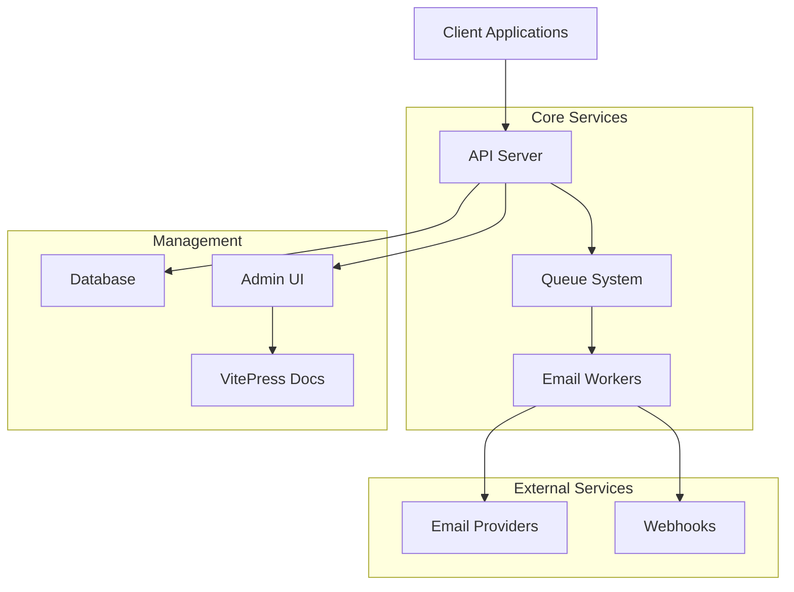

# Internal Waymore Email Notification System

A modern, scalable email service with RESTful API, template management, and admin dashboard.

---

## Features

  <h3>🚀 High Performance</h3>
  <ul>
    <li>Built with Fastify for maximum speed</li>
    <li>Redis-based queue system</li>
    <li>Horizontal scaling support</li>
    <li>Optimized for high throughput</li>
  </ul>

  <h3>🎨 Template System</h3>
  <ul>
    <li>Handlebars templating engine</li>
    <li>Multi-locale support</li>
    <li>Real-time preview</li>
    <li>Version control</li>
  </ul>

  <h3>🔧 Easy Integration</h3>
  <ul>
    <li>RESTful API</li>
    <li>Webhook support</li>
    <li>Multiple SDKs</li>
    <li>Comprehensive documentation</li>
  </ul>

  <h3>🖥️ Admin Dashboard</h3>
  <ul>
    <li>Modern React-based UI</li>
    <li>Real-time monitoring</li>
    <li>Template management</li>
    <li>Message analytics</li>
  </ul>

## Quick Links

  <h4>For Developers</h4>
  <ul class="list-none">
    <li><a href="/quick-start">Quick Start</a></li>
    <li><a href="/guides/developer">Developer Guide</a></li>
    <li><a href="/api/">API Reference</a></li>
    <li><a href="/guides/architecture">Architecture</a></li>
  </ul>

  <h4>For Administrators</h4>
  <ul class="list-none">
    <li><a href="/admin/">Admin Dashboard</a></li>
    <li><a href="/guides/deployment">Deployment</a></li>
    <li><a href="/guides/cleanup">Maintenance</a></li>
    <li><a href="/guides/monorepo-structure">Project Structure</a></li>
  </ul>

  <h4>Integration</h4>
  <ul class="list-none">
    <li><a href="/guides/templates">Templates</a></li>
    <li><a href="/guides/routee">Routee Integration</a></li>
    <li><a href="/guides/locale-system">Locale System</a></li>
    <li><a href="/guides/">All Guides</a></li>
  </ul>

---

## System Architecture

## Getting Help

- 📖 [Complete Documentation](/guides/) - All guides in one place
- 🔧 [API Reference](/api/) - Detailed API documentation
- 💬 [GitHub Issues](https://github.com/cantoniouwaymore/emailgateway/issues) - Report bugs and request features
- 📧 [Email Support](mailto:cantoni@waymore.io) - Direct support contact