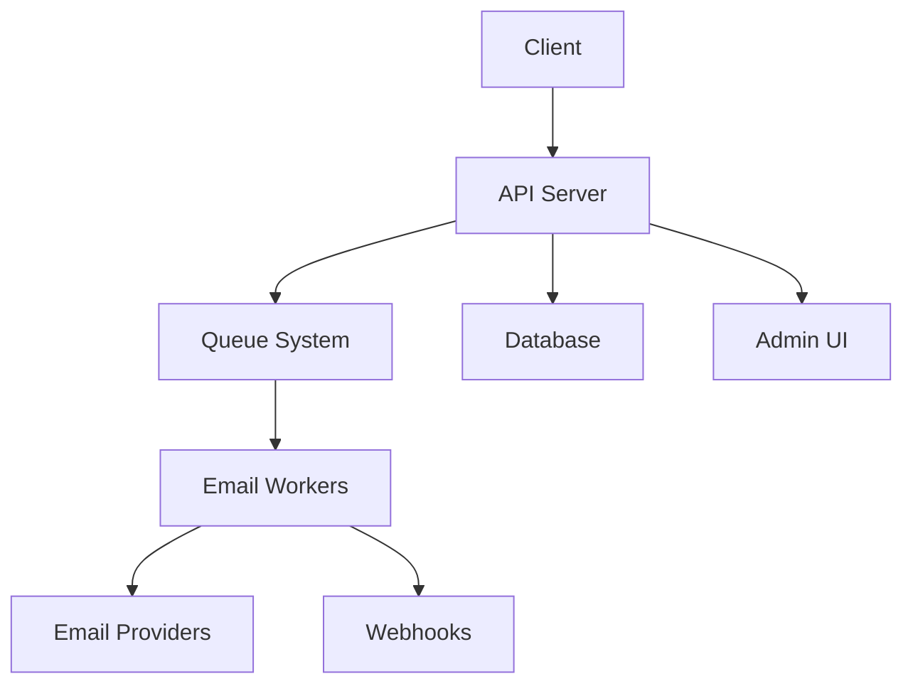

# Email Gateway Documentation

Welcome to the Email Gateway documentation! This comprehensive guide will help you integrate and use our powerful email service.

## What is Email Gateway?

Email Gateway is a complete email service solution that provides:

- **RESTful API** for sending transactional emails
- **Template Management** with Handlebars support
- **Admin UI** for managing templates and monitoring
- **Webhook Support** for real-time notifications
- **Multiple Providers** with failover support
- **Queue System** for reliable delivery

## Quick Start

Get up and running in minutes:

1. **Install** the service
2. **Configure** your email providers
3. **Create** your first template
4. **Send** your first email

[Get Started →](/quick-start)

## Key Features

### 🚀 High Performance
- Built with Fastify for maximum speed
- Redis-based queue system
- Horizontal scaling support

### 🎨 Template System
- Handlebars templating engine
- Multi-locale support
- Real-time preview

### 📊 Admin Dashboard
- Modern React-based UI
- Real-time monitoring
- Template management

### 🔌 Easy Integration
- RESTful API
- Webhook support
- Multiple SDKs

## Architecture

## Getting Help

- 📖 [Full Documentation](/guides/)
- 🔧 [API Reference](/api/)
- 💬 [GitHub Issues](https://github.com/cantoniouwaymore/emailgateway/issues)
- 📧 [Support](mailto:cantoni@waymore.io)

---

Ready to get started? Check out our [Quick Start Guide](/quick-start)!
